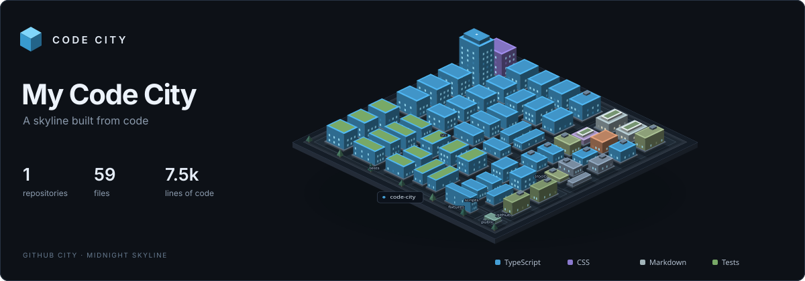
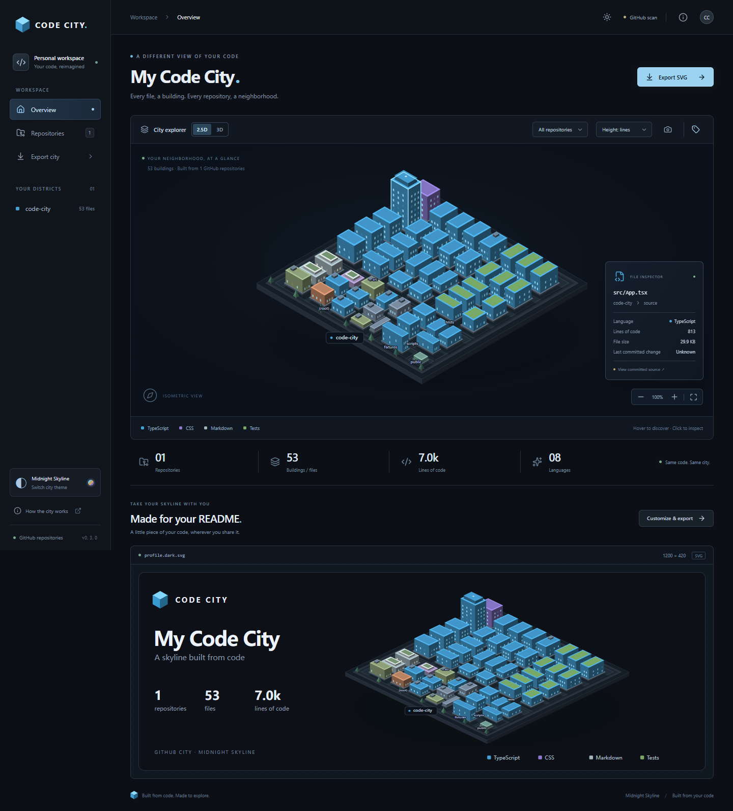
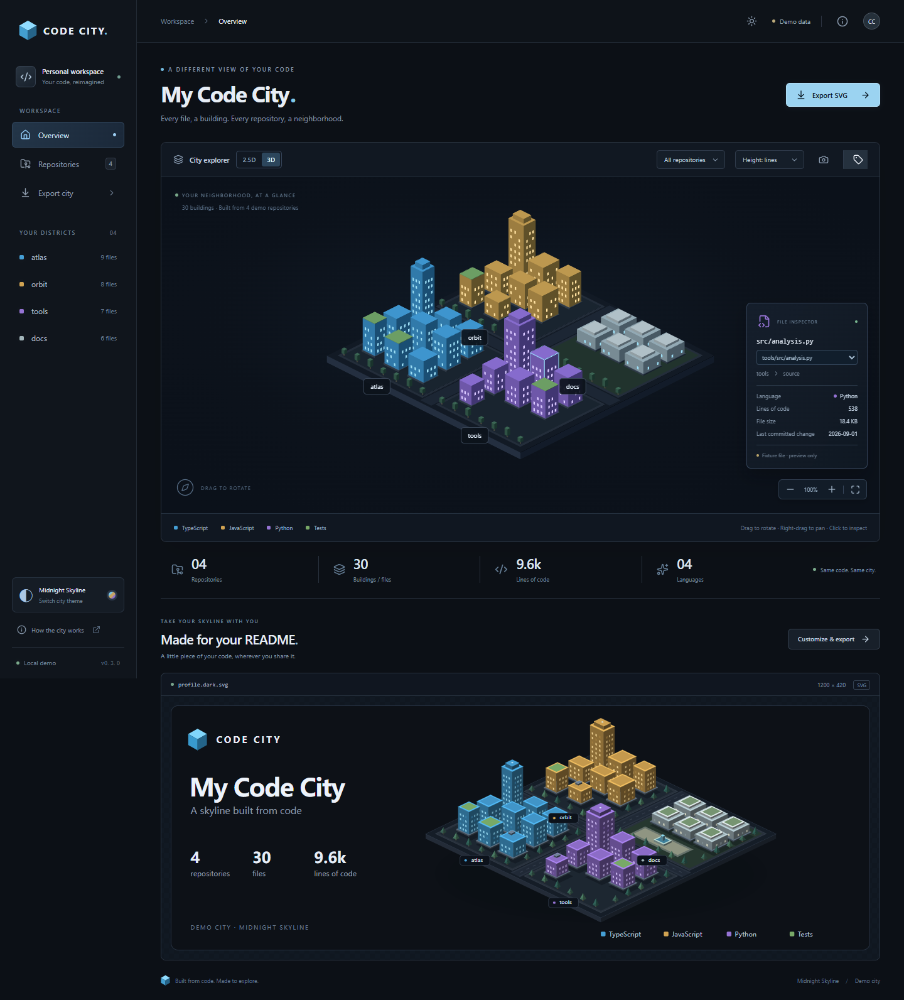

# Code City

**A skyline built from code.** Turn repositories into deterministic isometric cities.

[在线体验](https://hyt0019.github.io/code-city/) · [独立仓库城市](https://hyt0019.github.io/code-city/repos/code-city/) · [自动构建与部署](https://github.com/hyt0019/code-city/actions/workflows/deploy-pages.yml)



## 当前进度

已按所选 **A · 午夜天际线（Midnight Skyline）** 接通本地与公开 GitHub 扫描、确定性布局、SVG 横幅、交互式 3D 浏览和 GitHub Pages 自动部署，当前版本 **0.3.0**。

- React、TypeScript、Vite 单项目；可扫描本地仓库，也保留 30 栋建筑、4 个虚构仓库的演示数据。
- 支持 Git 仓库和普通目录、嵌套 `.gitignore`、语言和文件类别识别、有效行数/字节数/内容哈希、Git commit 元数据。
- 使用 D3 squarified treemap 分配仓库、一级目录和文件地块，排序稳定，建筑无重叠。
- 原生 SVG 等距城市：连续街区、道路、窗灯、地标、测试绿顶、文档广场。
- 响应式预览页，支持仓库高亮、鼠标悬停、点击或键盘选择建筑、缩放、重置、城区标签开关。
- 2.5D / 3D 切换：Three.js 支持拖动旋转、平移、缩放、悬停高亮和点选文件，也可通过下拉框使用键盘选择文件。
- 深色 Midnight Skyline 和浅色 Daylight Skyline 同步作用于页面、城市和导出；切换主题不会重排建筑。
- 自定义横幅标题和副标题，导出个人城市 `1200 × 420` 或单仓库 `900 × 315` 的自包含 SVG。
- 场景导出为 `generated/scene.json`，SVG 与 3D 读取同一份坐标、建筑尺寸和文件信息。
- 不调用 AI API，不依赖后端、数据库、登录、外部字体或图片。

当前预览显示 **Local scan**、**GitHub scan** 或 **mixed scan**，演示模式显示 **Demo data**。已支持公开 GitHub 仓库浅克隆、元数据缓存和固定到 commit 的源码链接；本地有未提交修改或没有 Git 历史时只展示本地文件信息。

## 启动

使用 Node.js 24 LTS（`.nvmrc` 固定 24.18.0，与当前验证环境一致）及 npm。依赖精确版本和锁文件已经保存。

```sh
npm ci
npm run dev
```

打开终端显示的本地地址，默认是 `http://127.0.0.1:5173`。

```sh
npm run generate     # 写出 SVG 和 scene.json
npm run build        # 类型检查、生成静态产物、生产构建
npm run preview      # 预览 dist，默认端口 4173
```

扫描真实目录（可重复 `--repo` 聚合最多 8 个本地仓库）：

```sh
npm run generate -- --repo .
npm run generate -- --repo ../project-a --repo ../project-b
npm run generate -- --github hyt0019/code-city
npm run build
npm run dev
```

包含空格的路径请加引号。生成后刷新浏览器即可；构建会保留已有场景，不会把真实数据覆盖回演示数据。重新扫描可更新城市。恢复演示场景使用 `npm run generate -- --demo`。

本地和公开 GitHub 输入可混合，最多 8 个仓库。默认配置扫描当前项目；`--repo` / `--github` 参数会替换配置中的仓库列表。公开仓库可在配置中指定分支、标签或 commit：

```ts
repositories: [
  { path: '.', name: 'my-local-project' },
  { github: 'OWNER/REPOSITORY', ref: 'main', name: 'project-a' },
  { github: 'OWNER/ANOTHER-REPOSITORY', name: 'project-b' },
];
```

`ref` 默认跟随远程 HEAD，`name` 默认使用仓库名；多个同名仓库需指定不同别名。公开仓库只在生成阶段下载到 `.cache/github/`，每次获取最新选定 ref，后续复用浅克隆缓存。不会运行下载仓库的脚本、安装依赖或拉取子模块，也不会发送本地 Git 凭据。

GitHub 描述和 Star 元数据缓存 6 小时。接口限流、离线或响应异常时使用旧缓存或仅生成文件数据；Git 源码获取失败会停止生成，避免静默发布过期代码。确认没有任何 refs 的空仓库会生成空城区。可选通过环境变量 `GITHUB_TOKEN` 提高元数据 API 限额；令牌只留在构建进程，不进入缓存 JSON 或浏览器。当前不支持私有仓库。

生成结果：

| 文件                                               | 用途                                               |
| -------------------------------------------------- | -------------------------------------------------- |
| `generated/profile.svg`                            | 可独立打开或嵌入 README 的横幅                     |
| `generated/profile.dark.svg` / `profile.light.svg` | 明确指定深色或浅色的个人横幅                       |
| `generated/repos/<name>.svg`                       | 单仓库横幅，同时提供 `.dark.svg` / `.light.svg`    |
| `generated/scene.json`                             | 带版本号的城市中间模型                             |
| `generated/snapshots.json`                         | 本地扫描得到的标准仓库快照，不含绝对路径或源码内容 |
| `public/assets/profile.svg`                        | 网页的静态横幅入口                                 |
| `public/assets/scene.json`                         | 网页可访问的场景数据                               |
| `public/assets/repos/`                             | 网页可访问的单仓库横幅，与 `generated/repos/` 同步 |
| `generated/manifest.json`                          | 本次生成的产物列表，重建时清除已移除仓库的旧横幅   |
| `dist/`                                            | 完整静态网站，构建时同步生成横幅与 JSON            |

页面只读取 `assets/scene.json`，使用 Zod 校验，再交给渲染器。静态图和 2.5D 预览调用同一个 `renderCityContents()`；3D 将地面 Y 坐标转换为 Three.js 的 Z 轴，不另算布局。数据加载失败时显示独立 SVG 和重试按钮；空目录提供空状态。

## 浏览城市

- 点击城市工具栏的 **3D**：拖动旋转、右键拖动平移、滚轮缩放。手机支持单指旋转、双指缩放和平移。
- 悬停高亮建筑，点选后在文件详情查看路径、语言、行数和大小；**Inspect file** 下拉框也支持键盘操作。
- 聚焦 3D 画布后，方向键旋转，Home 恢复默认视角。右下角按钮调整缩放或重置取景。
- **Building height** 下拉框可按有效代码行数或文件字节数映射建筑高度，保留文件选择、城区位置和建筑占地。2.5D、3D 和下载的 SVG / PNG 同步使用所选指标。`appearance.heightMetric: 'lines' | 'bytes'` 设置构建默认值；线上 README 链接始终引用构建时生成的指标。
- 顶栏太阳 / 月亮按钮切换主题，手机上同样可用。工具栏标签按钮控制城区名称。
- `?repo=tools` 可打开指定仓库的高亮视图，名称需要与当前场景一致。
- `repos/<name>/` 是独立仓库页面，只展示该仓库的建筑；点击文件详情中的仓库名进入，点击页顶 **All repositories** 返回城市总览。构建会写出真实 HTML，支持 GitHub Pages 子路径和直接刷新；禁用 JavaScript 时仍展示对应 SVG。

默认先显示 SVG，Three.js 只在第一次打开 3D 时加载。建筑使用 InstancedMesh 合批；没有自动旋转和持续动画循环，空闲时不绘制新帧，兼容减少动态效果的系统设置。WebGL 不可用、加载失败或上下文丢失时自动恢复 SVG，导出仍可使用。当前直接使用 Three.js，避免 React Three Fiber 当前对 React 19.3 的 peer dependency 限制。

## 导出和嵌入

点击页面右上角 **Export SVG**，在 **Export scope** 中选择所有仓库或单个仓库，修改标题和副标题，再点击 **Download SVG**。个人横幅为 `1200 × 420`，单仓库横幅为 `900 × 315`，使用当前深浅主题。下载文件如 `code-city-profile.svg`、`code-city-tools-light.svg`，无脚本和外部资源，离开网页也能使用。

单仓库导出仅调整镜头取景，保留原始建筑位置和尺寸。构建会同时生成默认主题、深色和浅色三个版本；默认主题由 `appearance.theme` 决定。中文、特殊字符和 Windows 保留名称使用安全文件名，可在产物清单中查看对应路径。

导出窗口的 **Download PNG** 将当前标题、主题和仓库选择保存为 2 倍分辨率 PNG：个人横幅 `2400 × 840`、单仓库 `1800 × 630`。城市工具栏的相机按钮 **Download view PNG** 保存当前视角：2.5D 保留缩放、筛选与标签，3D 保留旋转、平移、缩放与标签。图片使用当前主题背景，在浏览器本地生成，不上传任何数据。

当前项目的 README 可直接引用：

```md

```

其他仓库部署至 GitHub Pages 后，将以下占位符换成自己的用户名和部署路径：

```md
[](https://USERNAME.github.io/code-city/)
```

线上导出窗口的 **Copy README snippet** 会复制完整图片地址和对应城市页面链接，可直接粘贴到 GitHub README，并跟随所选仓库和深浅主题。链接指向已发布的默认横幅；临时修改的标题、副标题只用于 **Download SVG** 下载文件，修改配置并重新部署才会更新线上横幅。在本地预览时复制的是本机地址，需要先部署再分享。

## GitHub Pages 自动部署

仓库包含两个工作流：PR / 手动运行的 **Check Code City**，以及复用同一检查流程的 **Deploy Code City**。发布前会重新扫描配置中的仓库，运行格式检查、单元测试、类型检查、生产构建、桌面/手机交互和 Pages 子路径检查；全部通过后才上传并部署 `dist/`。

1. 在 GitHub 仓库 **Settings → Pages → Build and deployment → Source** 选择 **GitHub Actions**。
2. 推送代码或配置到 `main`，或在 Actions 中手动运行 **Deploy Code City**。
3. 部署成功后访问 `https://OWNER.github.io/REPOSITORY/`，独立仓库页为 `repos/<name>/`。

工作流还会在每周一 02:17 UTC（北京时间 10:17）刷新城市。修改 `codecity.config.ts` 即可选择最多 8 个本地 / 公开 GitHub 仓库；发布时本地路径必须存在于 runner，跨仓库配置通常使用 `{ github: 'owner/repo' }`。默认扫描刚检出的 Code City，因此源码链接固定到这次构建的 commit。

构建只需要 `contents: read`；部署作业单独获得 `pages: write` 和 `id-token: write`。不会提交生成文件回仓库，也不需要创建 PAT。Actions 固定到已核实的提交版本，Node.js 使用 `.nvmrc`。GitHub Pages 子路径使用相对资源，无需手工修改 Vite base。

自己的 GitHub 个人主页可使用：

```md
[](https://hyt0019.github.io/code-city/)
```

GitHub README 也可以跟随阅读者的主题自动切换图片：

```html
<picture>
  <source media="(prefers-color-scheme: dark)" srcset="./generated/profile.dark.svg" />
  <source media="(prefers-color-scheme: light)" srcset="./generated/profile.light.svg" />
  
</picture>
```

## 数据与视觉配置

- `fixtures/city.ts`：固定文件列表、城区位置、建筑大小和语言配色。
- `codecity.config.ts`：本地仓库列表、排除规则、默认标题、副标题与导出显示设置。
- `src/scanner/`：目录扫描、忽略规则、语言识别及本地 Git 元数据。
- `src/scanner/github.ts`：匿名公开仓库采集、浅克隆缓存和可降级的 GitHub 元数据读取。
- `src/layout/treemap.ts`：稳定的仓库/目录/文件土地分配。
- `src/core/model.ts`：`CityScene`、`RepositoryDistrict`、`Building`、主题与相机类型。
- `src/layout/isometric.ts`：纯函数等距投影与地面逆投影。
- `src/renderers/svg/city.ts`：纯 SVG 城市与横幅渲染。
- `src/renderers/three/`：按需加载的 Three.js 渲染、相机与指针交互、GPU 资源清理。
- `src/core/theme.ts` / `repository-scene.ts`：深浅配色和单仓库取景，保持场景几何不变。

真实模式按有效行数的对数权重给仓库与目录分配土地，以字节数的对数权重分配文件占地。每个地块保留道路间隔。建筑基础高度采用任务书中的对数缩放，少量入口文件额外提升为地标。排序不依赖文件系统枚举顺序；建筑 ID 来自仓库名和路径，窗灯由稳定哈希决定，`generatedAt` 不参与布局。演示模式保留经过确认的固定构图。

扫描默认排除依赖、构建和缓存目录、锁文件、压缩代码、生成文件、二进制文件；跳过超过 2 MB 的文件与非 UTF-8 文本，不跟随符号链接。文件上限默认 20,000，超限会报错而不是悄悄截断。有效行数排除空行及常见完整注释；这是轻量文本统计，不是语言编译器的语义分析。

文件详情的 **Last committed change** 来自最多 256 条近期主线提交：合并按进入当前主线的提交记录，重命名按新路径进入主线的时间记录。公开仓库和 CI 默认获取深度 257 的历史以保留边界；浅克隆边界、超出历史范围、无 Git 历史或读取失败的日期显示 **Unknown**，不会拿文件系统时间代替。本地未提交修改仍显示最近一次已提交的时间。窗灯按文件提交时间相对于该仓库扫描 commit 的时间衰减，近期更亮、长期未改较暗，未知维持默认亮度。亮度写入共享场景，不依赖当前日期或 `generatedAt`，因此重复生成保持一致。

可在 `codecity.config.ts` 配置 `repositories: [{ path: '../project-a', name: 'project-a' }]`，然后直接执行 `npm run generate`。不同仓库名称须唯一。可选 `scanner: { maxFileBytes: 2000000, maxFiles: 20000 }` 修改扫描边界。输入配置和场景数据均有 Zod 校验。

每种城市元素的解释可在页面 **How the city works** 中查看。`appearance.theme` 支持 `github-dark` 和 `github-light`；前端切换只影响当前预览和下载，修改配置可设置构建默认主题。

## 验证

```sh
npm run format:check  # Prettier 格式检查
npm test              # Vitest：坐标、确定性、边界、XML 等
npm run build         # TypeScript + SVG/JSON 生成 + Vite 构建
npm run test:e2e      # Playwright 桌面与手机浏览器检查
npm run test:pages    # 构建后检查独立页面、Pages 子路径和无 JavaScript 回退
```

Windows 默认使用已安装的 Microsoft Edge。其他平台默认使用 Playwright Chromium，首次运行需要执行 `npx playwright install chromium`。也可以通过 `PLAYWRIGHT_CHANNEL` 环境变量指定支持的浏览器通道。

单元测试涵盖：等距坐标与逆投影、配置校验、嵌套忽略和否定规则、二进制和生成文件过滤、中文/特殊字符路径、重命名、无 Git 历史、真实临时 Git 仓库与 commit URL、5,001 个文件的扫描和布局、超大文件权重、城区边界与无重叠、输入重排后的字节级一致性、SVG 快照及标准 XML 解析。

浏览器检查涵盖：桌面/手机渲染、无横向页面溢出、仓库筛选、键盘选择、缩放重置、标题编辑、实际下载内容、仓库导航、真实 JSON 加载、空目录及加载失败回退、关闭 JavaScript 后的独立 SVG，以及深浅主题、单仓库导出、3D 画布点选与拖动旋转、相机重置、空闲时无 WebGL 绘制、缺少 WebGL 和上下文丢失后的回退。默认示例横幅小于 500 KB；大仓库会减少窗户装饰，完整文件 SVG 仍可能超过这个软目标。

## 实现截图



手机截图见 [local-city-mobile.png](./previews/local-city-mobile.png)。三套前期概念图和演示截图保留在 `previews/`；概念图仅作为设计参考，成品渲染不使用这些图片。



浅色预览见 [daylight-desktop.png](./previews/daylight-desktop.png)，手机 3D 预览见 [three-mobile.png](./previews/three-mobile.png)。这些截图使用固定演示数据；真实扫描截图使用 `local-city-` 前缀。

## 后续路线图

本地 / 公开 GitHub 采集、独立仓库页面、Pages 部署链路、展示指标切换、逐文件提交时间与窗灯亮度、横幅 / 当前视角 PNG 导出已经实现。后续可增加 Star 地标细节与更多城市装饰；完整 Git 历史动画、私有仓库和登录服务不在当前 MVP 范围内。

技术参考：[Node.js 版本说明](https://nodejs.org/en/about/previous-releases)、[Vite 文档](https://vite.dev/guide/)、[Three.js OrbitControls](https://threejs.org/docs/pages/OrbitControls.html)。

## License

MIT，见 [LICENSE](./LICENSE)。
